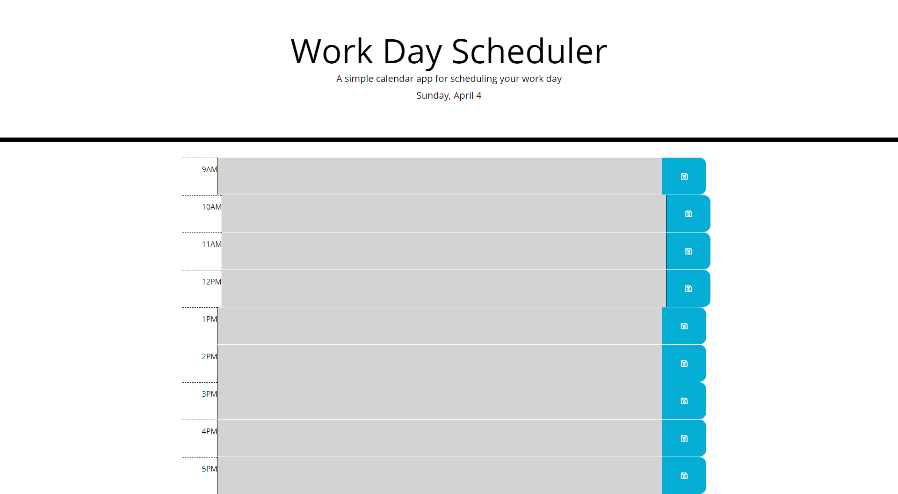

# work-day-scheduler
## Purpose
This application uses jquery and dayjs to create an interactive day planner for a standard 9 to 5 workday.  Clicking in the middle column will allow the user to type a task or activity to do for that hour.  Clicking on the save button will save that task to local storage allowing it to reload to the same hour upon a page refresh. The backgrounds of the time blocks change color to alert the user of coming tasks and tasks that have passed.  The present time block display's a red background.  Future time block's display a green background.  Time block's in the past display a grey background.

## Screenshot of Deployed Application

## Link to the Deployed Application
https://srwagner916.github.io/work-day-scheduler/

## Link to the GitHub Repositiory
https://github.com/srwagner916/work-day-scheduler

## Thank You
Shay Wagner